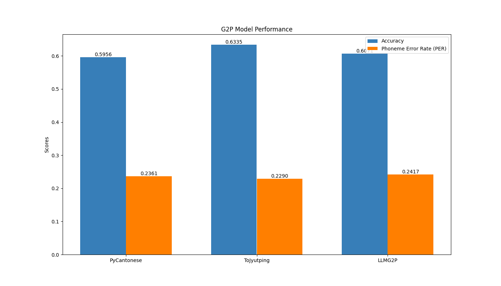
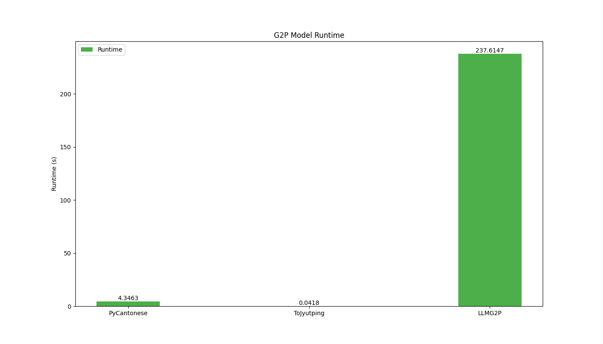

# Cantonese G2P Evaluation Benchmark

This project is a benchmark for evaluating Cantonese Grapheme-to-Phoneme (G2P) systems. The benchmark is based on the [Jyutping Romanization System](https://en.wikipedia.org/wiki/Jyutping). The data is obtained from [word.hk](https://words.hk/), 100 samples from [Dufu-Analysis](https://github.com/wingmingchan64/Dufu-Analysis) and 500 colloquial Chinese transcribed from [CanCLID/zoengjyutgaai_saamgwokjinji](CanCLID/zoengjyutgaai_saamgwokjinji).

The dataset includes character pairs along with their corresponding ground truth phonemes for G2P model evaluation. Each text file line contains a word, an underscore (_), and the target character for phoneme prediction. This format focuses on single-character phoneme prediction within words, making it suitable for assessing G2P models on specific characters.

## Metrics

The benchmark uses the following metrics:

- **Accuracy**: The percentage of words that are correctly converted the specified character from graphemes to phonemes.
- **Levenshtein Distance**: The average Levenshtein distance between the predicted phonemes and the ground truth phonemes.
- **Phoneme Error Rate (PER)**: The percentage of phonemes that are incorrectly predicted.

## Usage

### Pre-requisites

```bash
# pull submodules
git submodule update --init --recursive
# install dependencies
pip install -r requirements.txt
# install g2pW-Cantonese dependencies
pip install -r g2pW-Cantonese/requirements.txt
```

### Run the Benchmark

```bash
python run.py
```

## Leaderboard



## Runtime Comparison



## How to Submit

To submit your G2P system, please subclass the `G2PModel` class in `models` and implement the `_predict` method. Then, add your model to the `models` list in `run.py`. Finally, run `run.py` to generate the results.